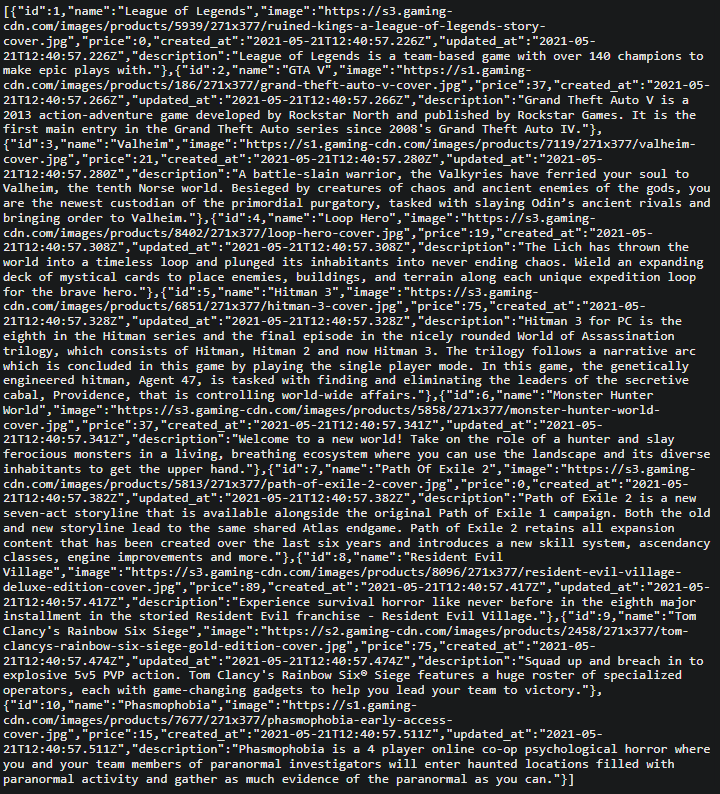

[![Contributors][contributors-shield]][contributors-url]
[![Forks][forks-shield]][forks-url]
[![Stargazers][stars-shield]][stars-url]
[![Issues][issues-shield]][issues-url]

<!-- PROJECT LOGO -->
<br />
<p align="center">
  <a href="https://github.com/e71az/games-list-api" style="text-decoration: none;">
    
  </a>

  <h2 align="center">Games List API</h2>

  <h3 align="center">Rails API Project --> games-list-api<h3>
  <p align="center">
    <a href="#table-of-contents"><strong>Explore the docs »</strong></a>
    <br />
    <br />
    -
    <a href="https://github.com/e71az/games-list-api/issues">Report a Bug</a>
    -
    <a href="https://github.com/e71az/games-list-api/issues">Request a Feature</a>
    -
  </p>
</p>

<!-- TABLE OF CONTENTS -->

## Table of Contents

- [About the Project](#about-the-project)
  - [Data View](#data-view)
  - [Built With](#built-with)
  - [Rules](#rules)
  - [Usage](#usage)
  - [Automated Test](#autoamted-test)
- [Contributors](#contributors)
- [Acknowledgements](#acknowledgements)
- [License](#license)

<!-- ABOUT THE PROJECT -->

## About The Project

This is the **games-list-api** final project where users are able to retrieve basic information about certain games like name, description, image and price. This API will be used by me to create a standalone React & Redux app to withdraw the information to.

### Data View



## Demo Link

[Games List](https://games-list-api.herokuapp.com/games)

[Favourites List](https://games-list-api.herokuapp.com/favourites)

## Usage Instructions

- To get the games list, use this as the API link: https://games-list-api.herokuapp.com/games

- For favourites: https://games-list-api.herokuapp.com/favourites

## Getting Started

To get a local copy up and running follow these simple example steps:

- Clone this repository into your local machine.
- Run:

```bash
  $ bundle install
```

- Run

```bash
  $ rails db:create
```

```bash
  $ rails db:migrate
```

```bash
  $ rails db:seed
```

- Run the rails server:

```bash
  $ rails server
```

- Enter in your web browser address bar:

  localhost:3000/games or localhost:3000/favourites

- Play with the app!

**Automated Test**

- Run the command and see the output

```
$ rspec
```

### Built With

This project was built using these technologies and main gems:

- Ruby on Rails
- Rspec
- Rubocop
- VsCode
- PostgreSQL
- Goldiloader
- Rails controller testing
- Factory bot rails
- Faker

## Potential future features

- To add a front page and log in capabilities to generate unique API keys

## Contributors

👤 **Elias Castañeda**

- Github: [@e71az](https://github.com/e71az)
- Linkedin: [@e71az](https://www.linkedin.com/in/eliasecasta/)

## :handshake: Contributing

Contributions, issues and feature requests are welcome!
Feel free to check the [issues page](https://github.com/e71az/games-list-api/issues)

## Show your support

Give a :star: if you like this project!

<!-- MARKDOWN LINKS & IMAGES -->
<!-- https://www.markdownguide.org/basic-syntax/#reference-style-links -->

[contributors-shield]: https://img.shields.io/github/contributors/e71az/games-list-api.svg?style=flat-square
[contributors-url]: https://github.com/e71az/games-list-api/graphs/contributors
[forks-shield]: https://img.shields.io/github/forks/e71az/dream-funding
[forks-url]: https://github.com/e71az/games-list-api/network/members
[stars-shield]: https://img.shields.io/github/stars/e71az/games-list-api
[stars-url]: https://github.com/e71az/games-list-api/stargazers
[issues-shield]: https://img.shields.io/github/issues/e71az/games-list-api.svg?style=flat-square
[issues-url]: https://github.com/e71az/games-list-api/issues

## 📝 License

This project is [MIT](https://opensource.org/licenses/MIT) licensed.
